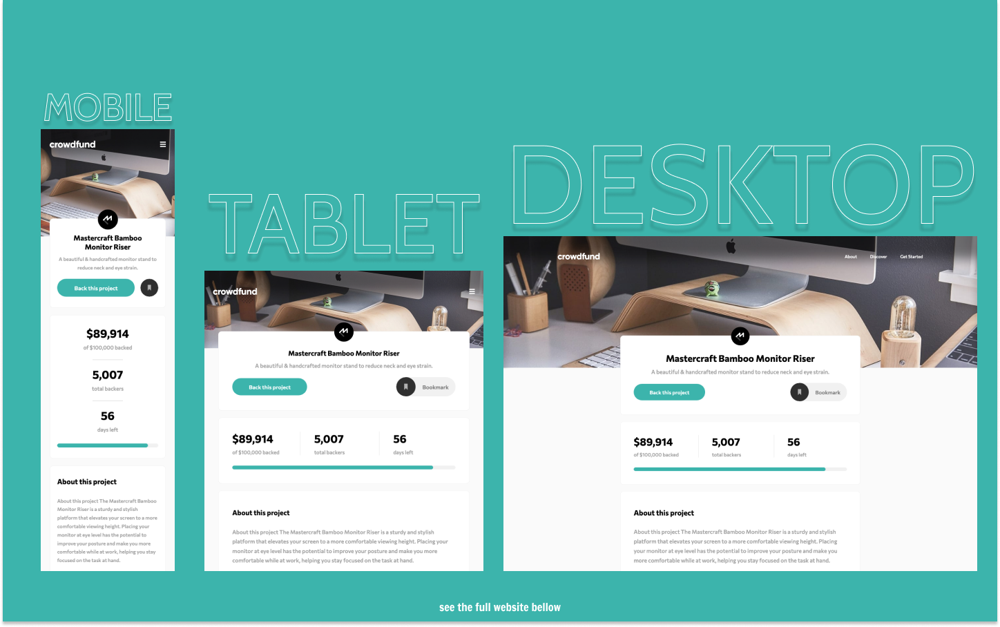

# Frontend Mentor - Crowdfunding Product Page Solution

This is a solution to the [Crowdfunding Product Page Challenge on Frontend Mentor](https://www.frontendmentor.io/challenges/crowdfunding-product-page-7uvcZe7ZR).

## Table of contents

- [Overview](#overview)
  - [The challenge](#the-challenge)
  - [Screenshot](#screenshot)
  - [Links](#links)
- [My process](#my-process)
  - [Built with](#built-with)
  - [Developer tools](#developer-tools)
  - [What I learned](#what-i-learned)
  - [Continued development](#continued-development)
  - [Useful resources](#useful-resources)
- [Author](#author)

## Overview

### The challenge

Frontend Mentor's challenges

Users should be able to:

- View the optimal layout depending on their device's screen size
- See hover states for interactive elements
- Make a selection of which pledge to make
- See an updated progress bar and total money raised based on their pledge total after confirming a pledge
- See the number of total backers increment by one after confirming a pledge
- Toggle whether or not the product is bookmarked

Challenges added by me

Users should be able to:

- See proper error messages if the input is invalid:
  - If the user inserts '0': `Can't be zero or start with zero`
  - If the input is less than 0: `Cannot be negative`
  - If more than two dots are inserted for decimal places: `Can't have two dots`
  - If the user tries to insert a huge amount or invalid number of people: `WTF!!! WHO ARE YOU???`
  - If the input is anything other than a number or if it's a negative number: `Cannot be a letter or special character`
  - If the user inserts less than required value: `Cannot be less than $25` or `Cannot be less than $75`
    respectively

### Screenshot

### Links

- Live Site URL: [https://kens-crowdfund.netlify.app/](https://kens-crowdfund.netlify.app/)
- Solution URL: [TO_BE_UPDATED](TO_BE_UPDATED)

## My process

### Built with

- Semantic HTML5 markup
- SCSS custom properties
- CSS Flexbox
- CSS Grid
- Vanila JS
- Mobile-first workflow

### Developer tools

- ESLint
- Parcel

### What I learned

I've learned a lot of new things and added some new tools to my workflow. Since the previous projects didn't involve really complex JS, I never had a chance to use a linter or a bundler. For the linter, I went with one of the most famous ones, `ESLint`. I'll experiment with it a lot more, this was just the beginning and as I go further, I'll tailor it more for my workflow. What comes to the bundler, I went with `Parcel`, just because it is really easy to set up and work with. I didn't want to overcomplicate it with `Webpack`, for a couple of reasons. First, it's pretty complex to set up. Two, this wasn't that big of a project to go for such a powerful bundler. Hence, Parcel was the great deal, and I'll also help me to bundle my `SASS` files in the upcoming projects. And finally I implemented some really simple transitions for toggling the modals, but hey, the less is more in this case. Lastly, since I split my JS to some other files I had to move to `Netlify`, which I've had a pleasure to work with in the past.

### Continued development

There are a lot of things to develop, learn, integrate, and practice, especially after this project. `ESLint` was really helpful, especially when refactoring the code. I also really liked `Parcel` for its simplicity and pace. In the future I'll go for more complex animating libraries, but for this project I feel like the simpler it is, the more professional it looks.

### Useful resources

- [Custom Progress Bar](https://codepen.io/kens-visuals/full/KKvxEgw) - I built this progress bar for my friends project, and it helped me to build the one in this project. I hope it helps you too.

## Author

- Frontend Mentor - [@kens-visuals](https://www.frontendmentor.io/profile/kens-visuals)
- Codewars - [@kens_visuals](https://www.codewars.com/users/kens_visuals)
- CodePen - [@kens-visuals](https://codepen.io/kens-visuals)
